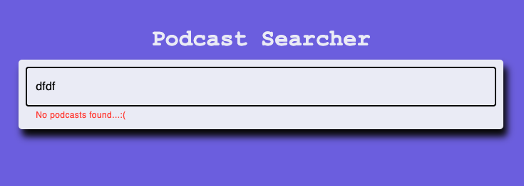
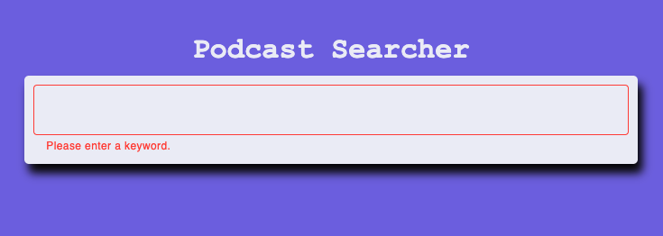
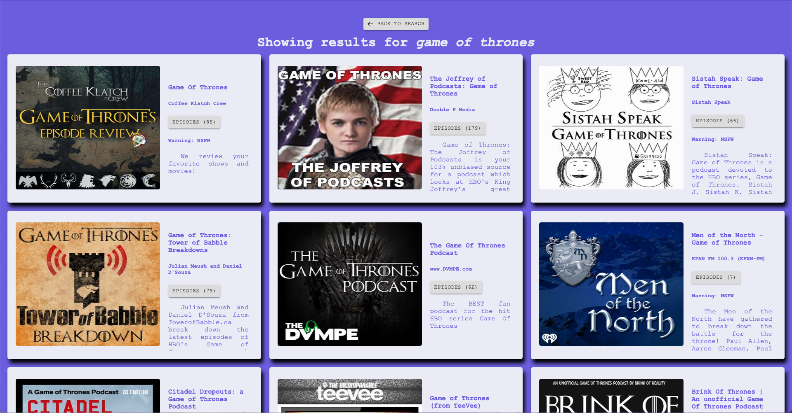

# Podcast Searcher

React app that fetches podcasts for leisure and lets you listen to them; made with a React frontend and a Node backend.

# Getting Started with Podcast Searcher

- Clone this repository
- Before we execute the run scripts, there are some things that you will need to configure locally within your project:
  - At the root of the `client` directory and at the root of `server` directory, create a `.env` file
  - Within the `client/.env` file, you will need the two following environment variables, with `portNumber` being the port you wish to have listening on the backend:
  1. `REACT_APP_PODCAST_API_URL=http://localhost:portNumber/podcast/list`
  2. `REACT_APP_EPISODE_API_URL=http://localhost:portNumber/podcast/list/episodes`
  - Within the `server/.env` file, create the following two environment variables, with `portNumber` being the port for the backend and `yourAPIKey` being the developer API key that you are granted from Listen Notes:
  4. `API_KEY=yourApiKey`
  5. `LISTENING_PORT=portNumber`
- Finally, open two terminals:
  - In the first terminal, run `cd client && npm i && npm start`
  - In the second terminal, run `cd server && npm i && npm run dev`

Once you have both servers running, point your browser to `http://localhost:3000` and you are good to go!

Have fun, be respectful, and feel free to let me know what you think or ask for help.

